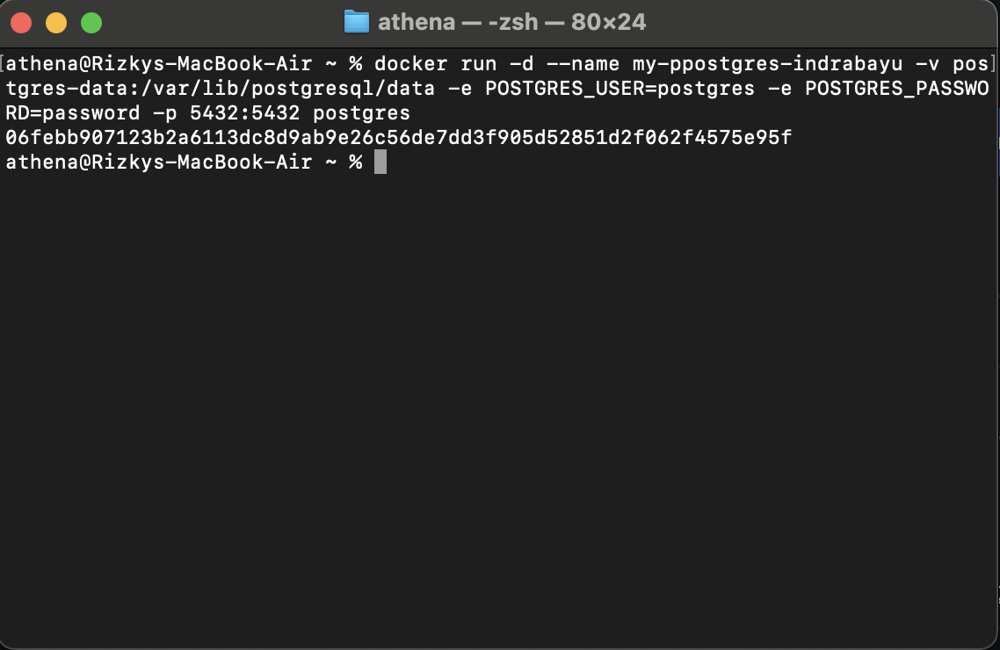
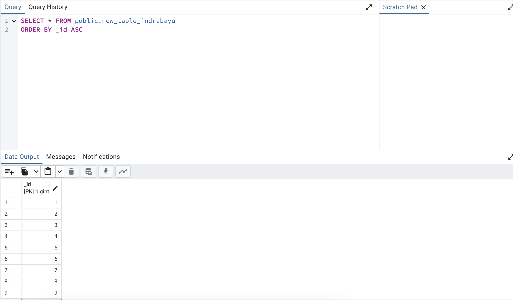
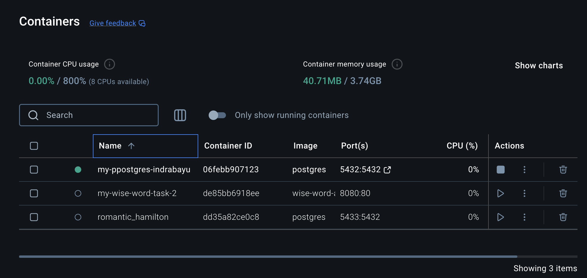
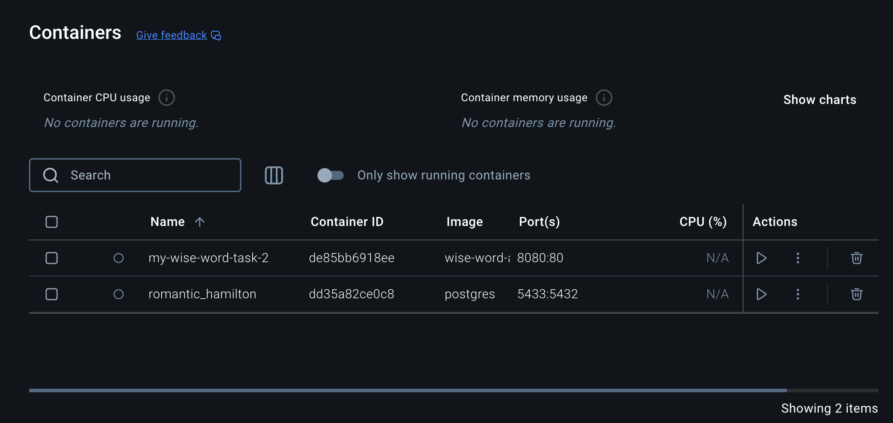
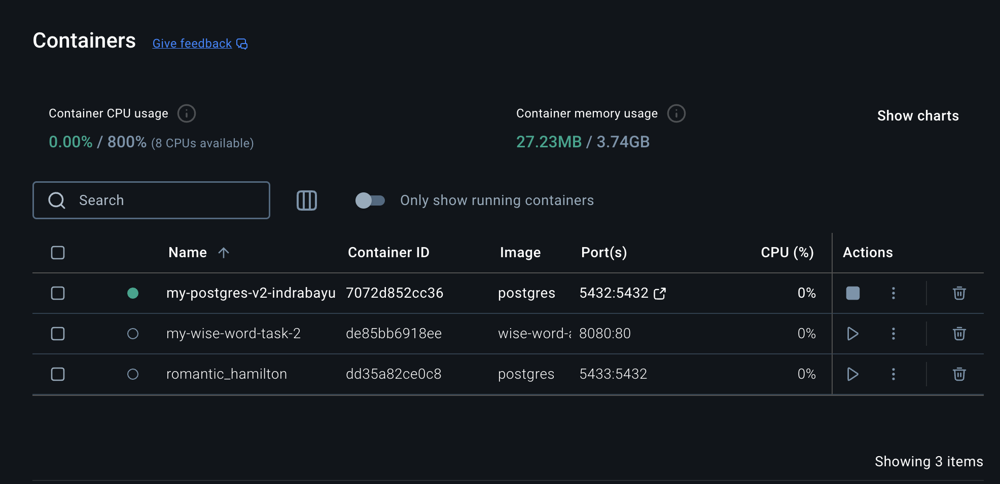
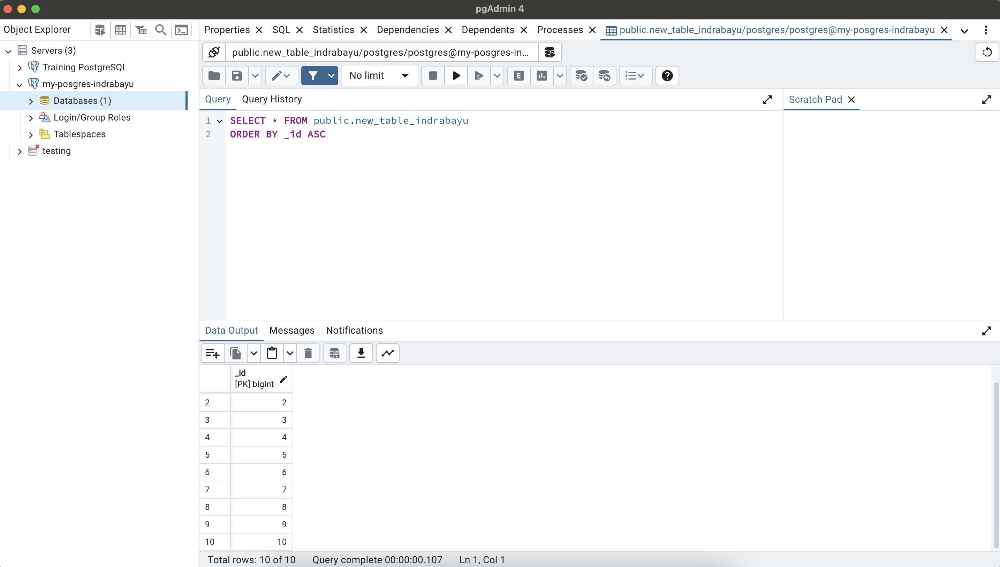

# Docker Task 2

### Initialize Docker Container
- Container Name: my-pposgres-indrabayu
- Volume Name: postgres-data
- PG username: postgres
- PG password: password
- Port: 5432

### Open PGAdmin4 and fill the table
- Table Name: new_table_indrabayu

### Open Docker and delete current container and making new ones
- Before (my-pposgres-indrabayu)

- Delete Current Container

- Add New Container (my-posgres-v2-indrabayu)

### Checking it again on PGAdmin4
boom! the data still there
